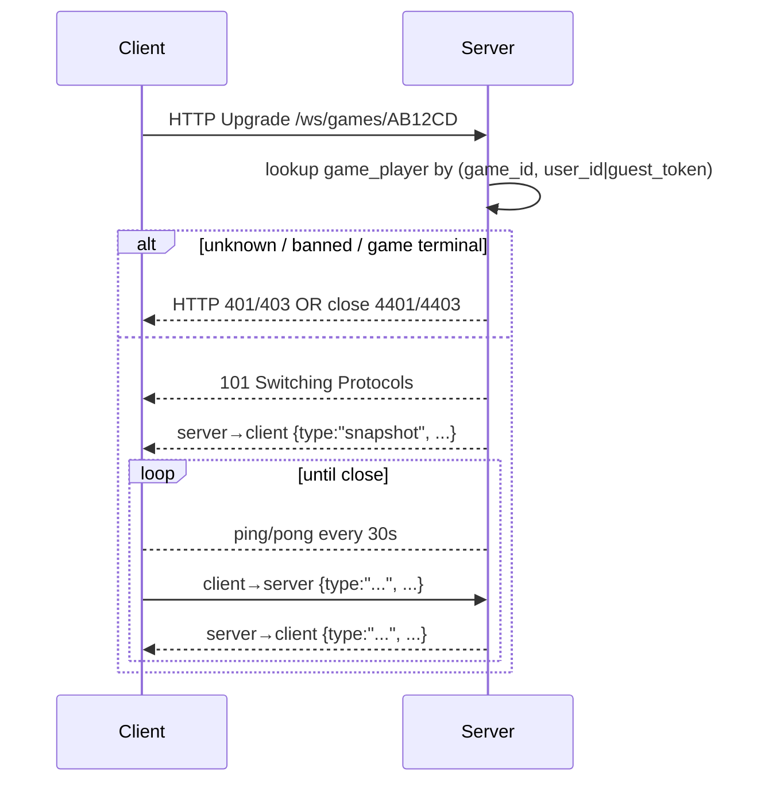

# API Specification

Authoritative contract for the JeopardyGame backend (`apps/server`).
References [`srs.md`](srs.md) (FR / NFR IDs) and [`use-cases.md`](use-cases.md)
(UC IDs).

> **Live spec.** With the dev server running (`apps/server: bun run dev`):
> - **OpenAPI JSON**: `http://localhost:3000/docs/json`
> - **Interactive UI** (Scalar): `http://localhost:3000/docs`
>
> The live spec is generated from Elysia `t` schemas and is the source
> of truth for **shapes**. This document remains the source of truth
> for **intent**, requirement traceability, and the WebSocket protocol
> (which OpenAPI does not cover).

The HTTP API is implemented in Elysia and consumed by the web client via
[`@elysiajs/eden`](https://elysiajs.com/eden/treaty.html). Types are
inferred end-to-end (`export type App = typeof app` → `treaty<App>()`),
so this document describes the wire contract; the source of truth for
field names is the Elysia route definition.

## 1. Conventions

- **Base URL (dev)**: `http://localhost:3000` (server). Web app at `:5173`.
- **Base URL (prod)**: `https://api.<domain>` (TBD).
- **Content type**: `application/json` for request and response bodies
  unless noted (`multipart/form-data` for uploads).
- **Auth**: HTTP-only session cookie set by `/auth/sign-in`. CORS allows
  credentials for the configured web origin only.
- **Time**: all timestamps are RFC 3339 UTC strings.
- **IDs**: UUID v4 strings.
- **Errors**: JSON envelope.
  ```json
  { "error": { "code": "string_machine_code", "message": "human text", "details": { } } }
  ```
  Standard `code` values: `unauthenticated`, `forbidden`, `not_found`,
  `validation_error`, `conflict`, `rate_limited`, `internal`.

### 1.1 Authorization tiers

| Tier | Header / cookie | Description |
| --- | --- | --- |
| Public | none | No auth required. |
| User | session cookie | Any logged-in user. |
| Verified | session cookie + `email_verified=true` | Required for hosting (FR-A2). |
| Owner | session cookie + resource ownership | Owner of the resource being modified. |
| Host | session cookie + game host | Host of the targeted game. |
| Player | session cookie OR guest cookie | Member of the targeted game. |

### 1.2 Status codes used

`200 OK`, `201 Created`, `204 No Content`, `302 Found` (verify-email
landing), `400 Bad Request` (validation), `401 Unauthorized`, `403
Forbidden`, `404 Not Found`, `409 Conflict`, `413 Payload Too Large`,
`415 Unsupported Media Type`, `422 Unprocessable Entity`, `429 Too Many
Requests`, `500 Internal Server Error`.

### 1.3 Rate limiting (NFR-S5)

| Endpoint group | Limit | Key |
| --- | --- | --- |
| `/auth/sign-in` | 5 / minute | IP |
| `/auth/sign-up` | 3 / hour | IP |
| `/auth/forgot-password` | 3 / hour | email |
| `/media` (POST) | 10 / minute | user |
| Other | 60 / minute | IP+session |

Exceeded → `429` with `Retry-After` header.

## 2. REST endpoints

### 2.1 Auth — handled by `better-auth`

Better-auth mounts under `/auth/*`. The shapes below are the contract
the web client uses; library-internal routes (e.g. CSRF token) are
included by default and may exist but are not part of v1's surface.

| Method | Path | Auth | Realises | Notes |
| --- | --- | --- | --- | --- |
| POST | `/auth/sign-up` | Public | FR-A1, UC1 | `{ email, password, name }` → `200 { user }` + Set-Cookie |
| POST | `/auth/sign-in` | Public | FR-A3, UC3 | `{ email, password }` → `200 { user }` + Set-Cookie |
| POST | `/auth/sign-out` | User | FR-A6, UC3 | `204` + clears cookie |
| GET | `/auth/verify-email` | Public | FR-A2, UC2 | `?token=…` → `302 /me` (verified) |
| POST | `/auth/forgot-password` | Public | FR-A7, UC4 | `{ email }` → `200` (always; no enumeration) |
| POST | `/auth/reset-password` | Public | FR-A7, UC4 | `{ token, password }` → `200` |
| POST | `/auth/change-password` | User | FR-A8 | `{ currentPassword, newPassword }` → `200` |
| GET | `/auth/me` | User | — | `200 { user, profile }` for the current session |

### 2.2 Profiles

| Method | Path | Auth | Realises | Body / response |
| --- | --- | --- | --- | --- |
| GET | `/users/:id` | Public | FR-P1, FR-P3 | `200 { id, displayName, avatarUrl, joinedAt, quizCount }` |
| GET | `/users/me` | User | FR-P4 | as above + `recentGames`, `quizzes` |
| PATCH | `/users/me` | User | FR-P2 | `{ displayName?, avatarMediaId? }` → `200 { profile }` |
| DELETE | `/users/me` | User | FR-A9, UC6 | `{ currentPassword }` → `204` |

### 2.3 Quizzes

| Method | Path | Auth | Realises | Body / response |
| --- | --- | --- | --- | --- |
| GET | `/quizzes` | User | FR-Q7 | `200 { items: Quiz[] }` (owned by current user, sorted by `updatedAt` desc) |
| POST | `/quizzes` | User | FR-Q1, UC10 | `{ title, description? }` → `201 { quiz }` (created with default 6 categories × 5 questions) |
| GET | `/quizzes/:id` | Owner | FR-Q6 | `200 { quiz, categories, questions, finalQuestion? }` |
| PATCH | `/quizzes/:id` | Owner | FR-Q6 | `{ title?, description? }` → `200 { quiz }` |
| DELETE | `/quizzes/:id` | Owner | FR-Q6 | `204` (cascades) |
| PATCH | `/categories/:id` | Owner | FR-Q2 | `{ title?, position? }` → `200` |
| PATCH | `/questions/:id` | Owner | FR-Q5 | `{ clue?, answer?, pointValue?, isDailyDouble?, mediaIds?: string[] }` → `200` |
| PUT | `/quizzes/:id/final` | Owner | FR-Q3 | `{ category, clue, answer }` → `200` (creates or replaces final question) |
| DELETE | `/quizzes/:id/final` | Owner | FR-Q3 | `204` |

### 2.4 Quiz sharing

| Method | Path | Auth | Realises | Notes |
| --- | --- | --- | --- | --- |
| POST | `/quizzes/:id/share` | Owner | FR-Q8, UC14 | `200 { token, url }` (creates or returns existing) |
| DELETE | `/quizzes/:id/share` | Owner | FR-Q8 | `204` (revokes token) |
| GET | `/share/:token` | Public | FR-Q8 | `200 { quizTitle, ownerDisplayName }` (no clues / answers) |

### 2.5 Media

| Method | Path | Auth | Realises | Notes |
| --- | --- | --- | --- | --- |
| POST | `/media` | User | FR-M1, FR-M2, UC15 | `multipart/form-data` field `file`. Returns `201 { id, kind, url, durationMs? }` |
| GET | `/media/:id` | Player or Owner | FR-M4 | Streams the media (`200` with proper `Content-Type`). 403 if neither owner nor a participant in a game referencing the media. |
| DELETE | `/media/:id` | Owner | — | `204` (only if no active reference) |

### 2.6 Games

| Method | Path | Auth | Realises | Notes |
| --- | --- | --- | --- | --- |
| POST | `/games` | Verified | FR-G1, FR-G3, FR-G6, UC20 | `{ quizId, options: { finalEnabled, buzzMs, answerMs } }` → `201 { game: { id, roomCode } }`. `409` if user already has an active game. |
| GET | `/games/:roomCode` | Player or Host | — | `200 { game, players, currentState }` (also obtainable via WS snapshot) |
| POST | `/games/:roomCode/join` | Public | FR-J1, FR-J2, UC30 | `{ displayName, guestToken? }` → `200 { playerId }` + Set-Cookie `guest_token` (if guest). `409` if full / not joinable. |
| POST | `/games/:roomCode/leave` | Player | FR-L3 | `204` |
| POST | `/games/:roomCode/abort` | Host | FR-G4, UC26 | `204` |
| GET | `/games/history` | User | FR-C2 | `200 { items: GameSummary[] }` games the user hosted or joined |
| GET | `/games/:roomCode/result` | Public if completed | FR-C1 | `200 { ranking, scores, completedAt }` |

### 2.7 Health / meta

| Method | Path | Auth | Notes |
| --- | --- | --- | --- |
| GET | `/health` | Public | `200 { ok: true, version }` for liveness probes |

## 3. WebSocket protocol

### 3.1 Endpoint

`GET /ws/games/:roomCode` upgraded to WebSocket. Authentication: the
session cookie or guest cookie is sent with the upgrade request.

### 3.2 Connection lifecycle



**Close codes**

| Code | Meaning |
| --- | --- |
| 1000 | Normal close (player left, game ended). |
| 4400 | Bad message (malformed JSON or unknown type). |
| 4401 | Unauthenticated (no session / guest token). |
| 4403 | Forbidden (not a member of this game). |
| 4404 | Game not found / aborted / completed. |
| 4429 | Rate limited (too many messages). |

### 3.3 Message envelope

All messages are JSON objects with at least `type` (string). Server may
add `at` (RFC3339 timestamp) and `seq` (monotonic per-game) on
`server→client` messages.

```ts
type ClientToServer = { type: string; [k: string]: unknown };
type ServerToClient = { type: string; at: string; seq: number; [k: string]: unknown };
```

### 3.4 `client → server` messages

Authorization column: H = host only, P = a buzzed/picking player, A =
any player.

| `type` | Auth | Payload | Realises |
| --- | --- | --- | --- |
| `kick` | H | `{ playerId }` | FR-L2 |
| `start_game` | H | `{}` | FR-L4 |
| `select_question` | H (or current picker) | `{ questionRef }` | FR-MG1 |
| `open_question` | H | `{}` | FR-MG1 |
| `close_question` | H | `{}` | FR-MG7 |
| `buzz` | A | `{}` | FR-MG2, UC31 |
| `judge` | H | `{ verdict: "correct" \| "incorrect" \| "no_answer" }` | FR-MG4, UC23 |
| `wager` | P | `{ amount: int }` | FR-DD2, FR-FJ2 |
| `start_final` | H | `{}` | FR-FJ1 |
| `fj_wager` | A | `{ amount: int }` | FR-FJ2 |
| `fj_answer` | A | `{ text: string }` | FR-FJ3 |
| `fj_judge` | H | `{ playerId, verdict }` | FR-FJ4 |
| `pause` | H | `{}` | FR-R3 |
| `resume` | H | `{}` | FR-R3 |
| `leave` | A | `{}` | FR-L3 |
| `ping` | A | `{}` | keepalive |

### 3.5 `server → client` messages

| `type` | When sent | Payload (selected fields) |
| --- | --- | --- |
| `snapshot` | on connect / resume | `{ game, players, scores, currentQuestion, board }` |
| `player_joined` | someone joins lobby/game | `{ player }` |
| `player_left` | leave / kick / disconnect timeout | `{ playerId, reason }` |
| `player_reconnected` | rejoin within 5 min | `{ playerId }` |
| `game_started` | on `start_game` | `{ startedAt }` |
| `question_open` | host opens question | `{ questionRef, opensBuzzAt, isDailyDouble }` |
| `buzz_open` | read delay elapsed | `{}` |
| `buzzed` | first valid buzz | `{ playerId, atServerMs }` |
| `judged` | host judged buzzed answer | `{ playerId, verdict, scoreDelta, newScore }` |
| `wager_pending` | DD or FJ entering wager phase | `{ playerId? , min, max }` |
| `clue_revealed` | after wager (DD), or after FJ wagers | `{ clue, mediaUrls? }` |
| `daily_double_pending` | DD selected | `{ pickerId, min, max }` |
| `fj_category` | FJ starts | `{ category }` |
| `fj_clue` | FJ wagers complete | `{ clue }` |
| `fj_answers` | players' written answers | `{ items: [{ playerId, text }] }` |
| `fj_done` | FJ scoring complete | `{ finalScores }` |
| `state_changed` | generic state transition (debug) | `{ from, to }` |
| `paused` | host disconnected or paused | `{ until?: string }` |
| `resumed` | host returned | `{}` |
| `game_completed` | game ends naturally | `{ ranking, scores }` |
| `game_aborted` | host aborted or timed out | `{ reason }` |
| `error` | server-side error addressed to this client only | `{ code, message }` |
| `pong` | reply to ping | `{}` |

### 3.6 Allowed messages by game state

A `client → server` message arriving in an invalid state SHALL be
rejected with `error{ code: "invalid_state" }` and ignored (NFR-S3).

| State | Valid client messages |
| --- | --- |
| `Lobby` | host: `start_game`, `kick`; players: `leave`, `ping` |
| `Active` (no question open) | host: `select_question`, `pause`, `start_final`, `abort` |
| `Active` (`Open` / `BuzzWindow`) | players: `buzz` (only in `BuzzWindow`); host: `close_question`, `pause` |
| `Active` (`Buzzed` / `Answering`) | host: `judge`, `pause` |
| `Active` (`Wagering` for DD) | picker: `wager`; host: `pause` |
| `Final Jeopardy: WagerCollect` | players: `fj_wager`; host: nothing |
| `Final Jeopardy: AnswerCollect` | players: `fj_answer` |
| `Final Jeopardy: Judging` | host: `fj_judge` |
| `Paused` | host: `resume`, `abort` |
| `Completed` / `Aborted` | none (clients should disconnect) |

## 4. Validation rules

Validation is done at every route boundary using Elysia's `t` schemas
(NFR-M3). Selected rules:

| Field | Rule |
| --- | --- |
| `email` | RFC 5321 email, lowercase, ≤ 254 chars |
| `password` | ≥ 12 chars, ≥ 1 letter, ≥ 1 digit (or otherwise per better-auth defaults) |
| `displayName` | 1–32 chars, no leading/trailing whitespace |
| `quiz.title` | 1–80 chars |
| `category.title` | 1–40 chars |
| `question.clue` | 1–500 chars |
| `question.answer` | 1–200 chars |
| `question.pointValue` | integer, multiples of 100, 100–2000 |
| `media.file` (image) | mime ∈ {png, jpeg, webp, gif}, ≤ 5 MB |
| `media.file` (audio) | mime ∈ {mpeg, ogg, wav}, ≤ 10 MB, ≤ 30000 ms |
| `roomCode` | 6 chars from `BCDFGHJKLMNPQRSTVWXYZ` (case-insensitive on input) |
| `wager` | integer ≥ 5 (DD) / ≥ 0 (FJ); ≤ player score (FJ) or DD bound (DD) |

## 5. Idempotency & retries

- `POST /games/:roomCode/join` is idempotent on `(roomCode, guestToken)`
  — repeating it returns the same `playerId` and does not create a
  duplicate slot.
- `POST /quizzes/:id/share` returns the existing token if one exists.
- Other `POST` endpoints are not idempotent; retries on network errors
  may create duplicate resources. The web client should debounce, not
  blind-retry.

## 6. Versioning

v1 endpoints are unversioned. If a breaking change ships, a `v2/` URL
prefix will be introduced and v1 supported for at least one deprecation
window (TBD in deployment plan). Additive changes (new optional fields,
new endpoints) are non-breaking.

## 7. Open questions

- **OQ-1** (re FR-J1): If guest play is forbidden (per Open Question
  OQ-1 in SRS), the cookie/path scheme for `guest_token` becomes moot
  and `POST /games/:roomCode/join` requires `User` auth.
- **OQ-4**: Whether `GET /share/:token` exposes the question count and
  category names or only the title.
