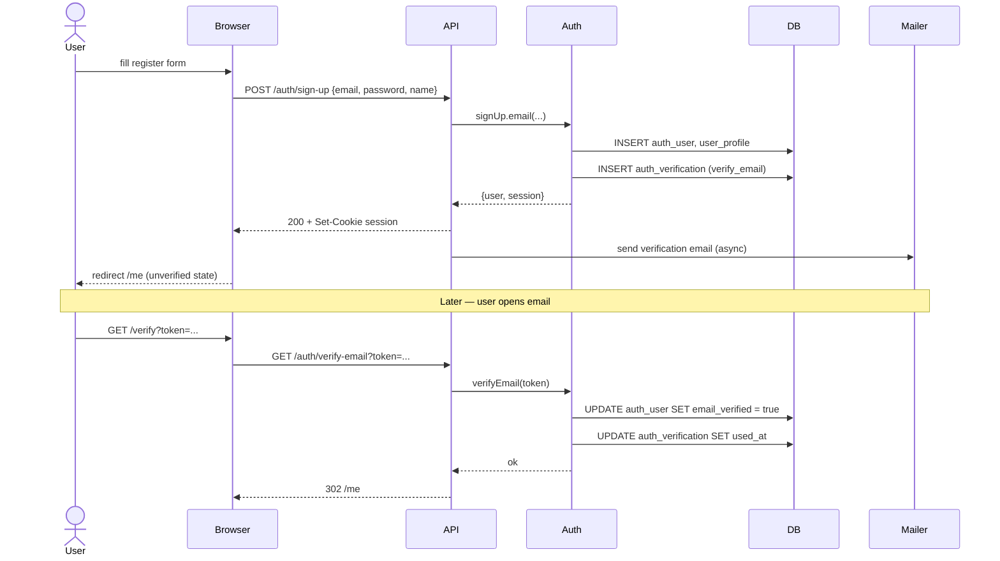
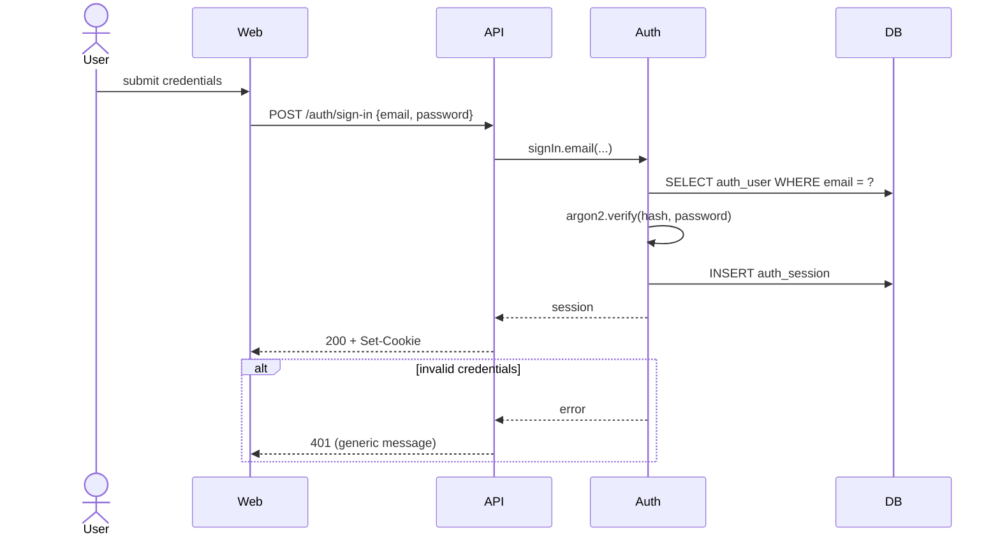
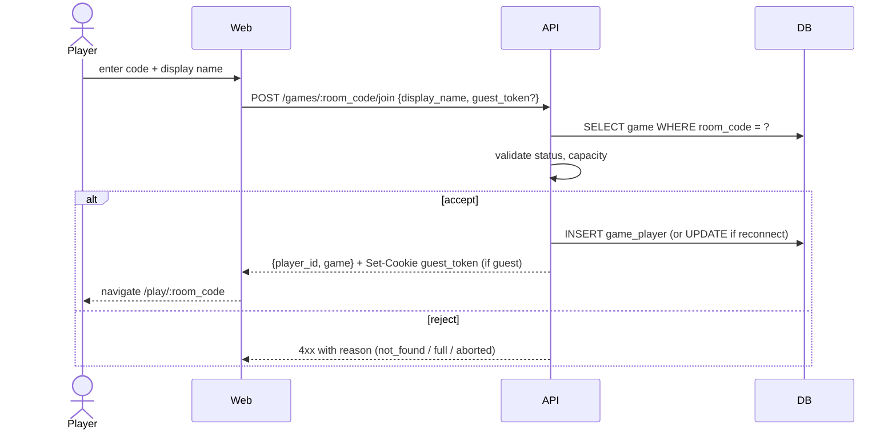
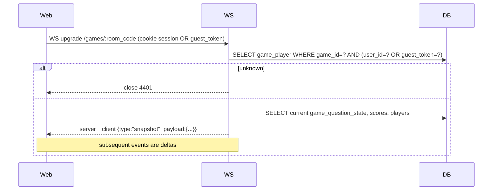
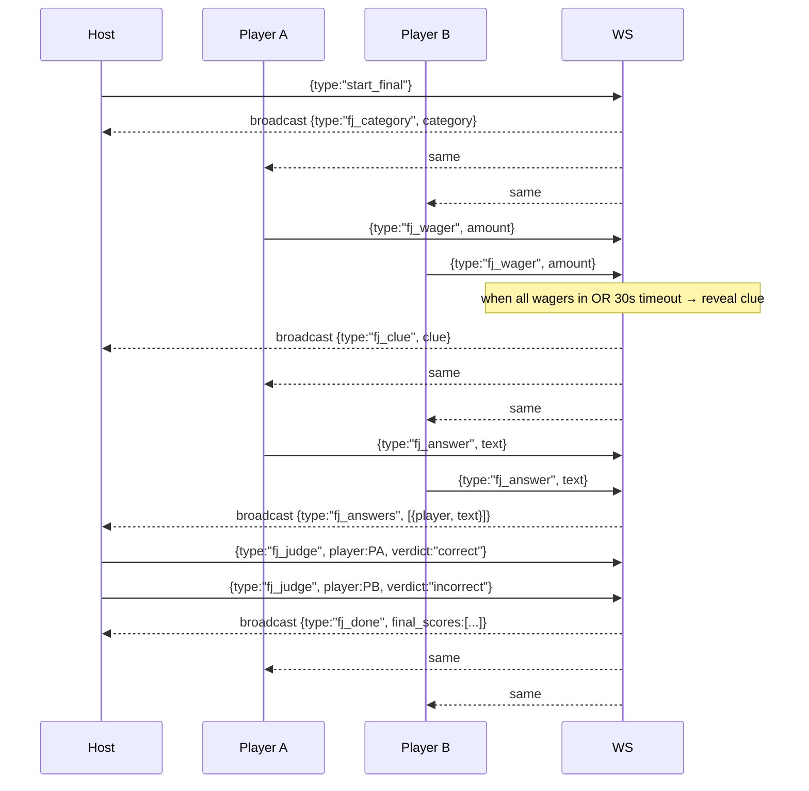
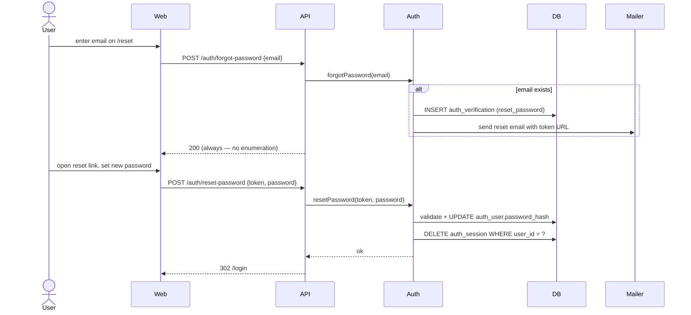
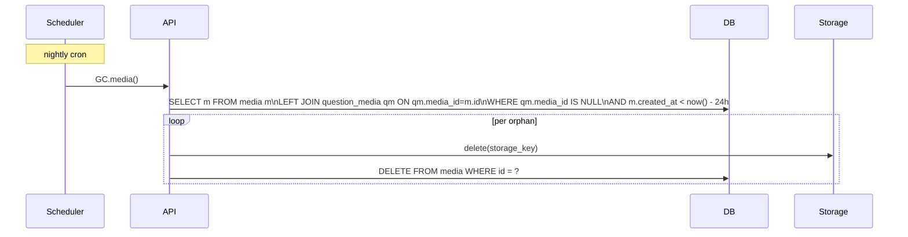

# Sequence Diagrams

Selected end-to-end flows. Each diagram traces messages between actors
and components for a single use case. Components:

- **Browser (Web)** — React SPA in `apps/web`.
- **API (Server)** — Elysia HTTP routes in `apps/server`.
- **WS (Server)** — Elysia WebSocket handler in `apps/server`.
- **Auth** — better-auth library inside the server.
- **DB** — PostgreSQL via Drizzle.
- **Storage** — local-disk Storage backend.
- **Mailer** — transactional email provider.

## 1. Register + email verification (UC1, UC2)



## 2. Login (UC3)



## 3. Create quiz + upload media (UC10, UC15)

```mermaid
sequenceDiagram
    actor Owner
    participant Web
    participant API
    participant Storage
    participant DB

    Owner->>Web: click "New quiz"
    Web->>API: POST /quizzes {title}
    API->>DB: INSERT quiz, 6 categories, 30 questions (defaults)
    API-->>Web: {quiz}

    Owner->>Web: edit clue, drop image
    Web->>API: POST /media (multipart)
    API->>API: validate type/size/duration
    API->>Storage: put(stream) → key
    API->>DB: INSERT media
    API-->>Web: {media: {id, url}}

    Web->>API: PATCH /questions/:id {clue, answer, media_ids:[...]}
    API->>DB: UPDATE question; UPSERT question_media
    API-->>Web: ok
```

## 4. Start game (UC20)

```mermaid
sequenceDiagram
    actor Host
    participant Web
    participant API
    participant DB

    Host->>Web: click "Host game" on quiz
    Web->>API: POST /games {quiz_id, options}
    API->>DB: SELECT 1 FROM game WHERE host_id=? AND status IN (lobby,active,paused)
    alt host has another active game
        API-->>Web: 409 Conflict
    else
        API->>DB: BEGIN
        API->>API: generate room_code (retry on collision)
        API->>DB: INSERT game (status=lobby)
        API->>DB: SELECT quiz tree; INSERT game_snapshot
        API->>DB: COMMIT
        API-->>Web: {game: {id, room_code}}
        Web-->>Host: navigate /host/:room_code
    end
```

## 5. Join game (UC30)



## 6. Connect to game WebSocket + initial snapshot (UC34, FR-R2)



## 7. Buzz cycle — single question (UC22, UC31, UC23)

```mermaid
sequenceDiagram
    participant HostWeb as Host Web
    participant P1Web as Player 1 Web
    participant P2Web as Player 2 Web
    participant WS
    participant DB

    HostWeb->>WS: client→server {type:"open_question", q_ref}
    WS->>DB: UPDATE game_question_state → open
    WS->>DB: INSERT game_event (type=open)
    WS-->>HostWeb: broadcast {type:"question_open", q_ref, opens_buzz_at:t+3s}
    WS-->>P1Web: same
    WS-->>P2Web: same

    Note over WS: 3s read delay elapses
    WS-->>HostWeb: broadcast {type:"buzz_open"}
    WS-->>P1Web: same
    WS-->>P2Web: same

    P1Web->>WS: client→server {type:"buzz"} (t1)
    P2Web->>WS: client→server {type:"buzz"} (t2 > t1)

    WS->>WS: first valid buzz wins (P1)
    WS->>DB: UPDATE state → buzzed; current_player_id=P1
    WS->>DB: INSERT game_event (type=buzz, actor=P1)
    WS-->>HostWeb: broadcast {type:"buzzed", player_id:P1}
    WS-->>P1Web: same
    WS-->>P2Web: same

    HostWeb->>WS: client→server {type:"judge", verdict:"correct"}
    WS->>DB: UPDATE game_player.score; UPDATE state → closed
    WS->>DB: INSERT game_event (type=judge)
    WS-->>HostWeb: broadcast {type:"judged", verdict:"correct", score_delta:+200}
    WS-->>P1Web: same
    WS-->>P2Web: same

    Note over WS: if verdict was incorrect/no-answer and players remain → state → buzz_open again
```

## 8. Reconnect mid-game (FR-R1, FR-R2)

```mermaid
sequenceDiagram
    actor Player
    participant Web
    participant WS
    participant DB

    Note over Player,Web: tab crashes / WS dies
    Web->>WS: WS upgrade /games/:room_code (cookie/token)
    WS->>DB: lookup game_player; mark status=joined
    WS->>DB: snapshot current state + scoreboard + recent events
    WS-->>Web: {type:"snapshot", payload:{...}}
    WS-->>WS: broadcast {type:"player_reconnected", player_id}
```

If absent > 5 min, the slot is released and the rejoin is treated as a
fresh join (subject to capacity, FR-R1).

## 9. Daily Double (UC24)

```mermaid
sequenceDiagram
    participant HostWeb as Host
    participant PWeb as Player P (picker)
    participant WS
    participant DB

    HostWeb->>WS: open_question {q_ref:DD}
    WS->>DB: UPDATE state → wagering; current_player_id=P
    WS-->>HostWeb: broadcast {type:"daily_double_pending", picker:P, min:5, max:...}
    WS-->>PWeb: same

    PWeb->>WS: {type:"wager", amount:1000}
    WS->>WS: validate bounds
    WS->>DB: UPDATE state → answering
    WS-->>HostWeb: broadcast {type:"clue_revealed"}
    WS-->>PWeb: same

    HostWeb->>WS: {type:"judge", verdict:"correct"}
    WS->>DB: UPDATE score (±wager); state → closed
    WS-->>HostWeb: broadcast {type:"judged"}
    WS-->>PWeb: same
```

## 10. Final Jeopardy (UC25, UC32)



## 11. Password reset (UC4)



## 12. Media garbage collection (UC43, FR-M5)


