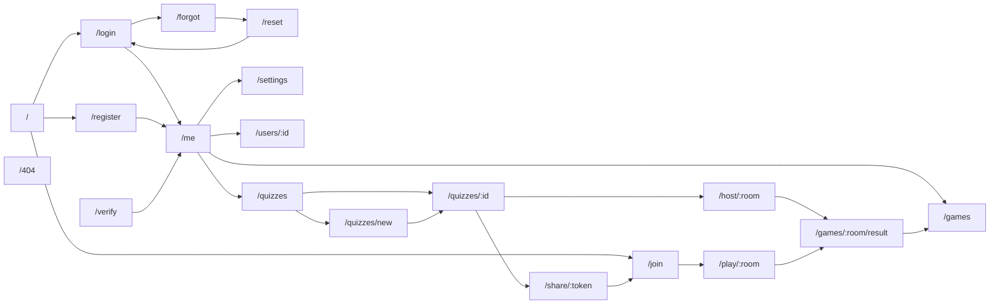

# Sitemap & Navigation

Frontend route map for `apps/web`. Routes are defined as TanStack
Router file routes under `apps/web/src/routes/`. References
[`srs.md`](srs.md) for FRs and [`use-cases.md`](use-cases.md) for UCs.

## 1. Layout layers

```mermaid
flowchart TB
    Root[__root: app shell] --> Marketing[(no layout) marketing pages]
    Root --> Unauth[_unauth: centered card layout]
    Root --> AuthLayer[_auth: requires session cookie]
    AuthLayer --> AuthVerified[_auth/_verified: requires email_verified]
    AuthLayer --> Play[/play/$roomCode: in-game shell]
    AuthLayer --> Host[/host/$roomCode: host shell]
```

| Layout | File | Guard | Purpose |
| --- | --- | --- | --- |
| `__root` | `routes/__root.tsx` | none | Global shell, devtools, error boundary. |
| `_unauth` | `routes/_unauth.tsx` | redirect to `/me` if logged in | Login, register, reset, verify pages. |
| `_auth` | `routes/_auth.tsx` | redirect to `/login` if no session | Profile, settings, quizzes. |
| `_auth/_verified` | `routes/_auth/_verified.tsx` | also redirect to `/me?banner=verify` if not email-verified | Hosting flows (FR-A2). |
| Game shells | `routes/play/$roomCode.tsx`, `routes/host/$roomCode.tsx` | auth + game membership | Live game UIs. |

## 2. Route table

| URL | File route | Layout / guard | Page name | Use case(s) | Notes |
| --- | --- | --- | --- | --- | --- |
| `/` | `routes/index.tsx` | public | Homepage | — | "Join with code" CTA + marketing. |
| `/join` | `routes/join.tsx` | public | Join Game | UC30 | Code + display name form. |
| `/login` | `routes/_unauth/login.tsx` | `_unauth` | Login | UC3 | |
| `/register` | `routes/_unauth/register.tsx` | `_unauth` | Register | UC1 | |
| `/forgot` | `routes/_unauth/forgot.tsx` | `_unauth` | Forgot password | UC4 | |
| `/reset` | `routes/_unauth/reset.tsx` | `_unauth` | Reset password (uses `?token=`) | UC4 | |
| `/verify` | `routes/_unauth/verify.tsx` | `_unauth` (no redirect) | Verify email (uses `?token=`) | UC2 | Lands here from email link. |
| `/me` | `routes/_auth/me.tsx` | `_auth` | Profile (owner) | UC5 | Includes verification banner if unverified. |
| `/users/$userId` | `routes/users.$userId.tsx` | public | Profile (visitor) | FR-P3 | |
| `/settings` | `routes/_auth/settings.tsx` | `_auth` | Settings | UC6, FR-A8 | Change password, delete account. |
| `/quizzes` | `routes/_auth/quizzes/index.tsx` | `_auth` | My Quizzes | FR-Q7 | |
| `/quizzes/new` | `routes/_auth/quizzes/new.tsx` | `_auth` | Quiz Creator | UC10 | Redirects to editor after create. |
| `/quizzes/$quizId` | `routes/_auth/quizzes/$quizId.tsx` | `_auth` (owner check) | Quiz Editor | UC11 | |
| `/share/$token` | `routes/share.$token.tsx` | public | Shared quiz preview | UC14 | Read-only, title only. |
| `/host/$roomCode` | `routes/host/$roomCode.tsx` | `_auth/_verified` (host check) | Host Game | UC21–UC26 | Lobby + board + controls. |
| `/play/$roomCode` | `routes/play/$roomCode.tsx` | public (member check via WS) | Player Game | UC30–UC34 | Lobby + buzzer. |
| `/games/$roomCode/result` | `routes/games.$roomCode.result.tsx` | public if game completed | Final Scoreboard | UC33 | |
| `/games` | `routes/_auth/games.tsx` | `_auth` | Game History | FR-C2 | Hosted + played. |
| `/404` | `routes/404.tsx` | public | Not Found | — | Catch-all. |
| `/500` | `routes/500.tsx` | public | Error | — | Rendered by error boundary. |

> **Convention**: file names with `_unauth` / `_auth` are layout
> wrappers (TanStack Router naming). The `$` prefix denotes a path
> param.

## 3. Navigation graph



## 4. Guards & redirects

Implemented in TanStack Router `beforeLoad` on the layout routes.

| Guard | Behaviour |
| --- | --- |
| `_unauth.beforeLoad` | If session exists → redirect to `/me`. |
| `_auth.beforeLoad` | If no session → redirect to `/login?next=<current>`. |
| `_auth/_verified.beforeLoad` | If session but `email_verified=false` → redirect to `/me?banner=verify`. |
| `host/$roomCode.beforeLoad` | Fetch `/games/:roomCode`. If 404/403 → `/404`. If user is not the host → `/play/$roomCode`. |
| `play/$roomCode.beforeLoad` | Open WS; on close 4401/4403/4404 → `/join?error=…`. |
| `quizzes/$quizId.beforeLoad` | Fetch quiz. If not owner → `/404` (mask existence). |
| `share/$token.beforeLoad` | Fetch share metadata; 404 if revoked. |

## 5. Page → API mapping

| Page | REST calls | WS messages consumed | WS messages produced |
| --- | --- | --- | --- |
| Login | `POST /auth/sign-in` | — | — |
| Register | `POST /auth/sign-up` | — | — |
| Forgot/Reset | `POST /auth/forgot-password`, `POST /auth/reset-password` | — | — |
| Verify | `GET /auth/verify-email` | — | — |
| Profile (owner) | `GET /users/me` | — | — |
| Profile (visitor) | `GET /users/:id` | — | — |
| Settings | `POST /auth/change-password`, `DELETE /users/me` | — | — |
| My Quizzes | `GET /quizzes` | — | — |
| Quiz Editor | `GET /quizzes/:id`, `PATCH /questions/:id`, `POST /media`, `PUT /quizzes/:id/final` | — | — |
| Share preview | `GET /share/:token` | — | — |
| Join | `POST /games/:roomCode/join` | — | — |
| Host Game | `POST /games`, `GET /games/:roomCode` | `snapshot`, `player_*`, `question_*`, `buzzed`, `judged`, `paused`, etc. | `start_game`, `select_question`, `open_question`, `judge`, `kick`, `pause`, `start_final`, `fj_judge` |
| Player Game | `GET /games/:roomCode` | same set as host minus host-only | `buzz`, `wager`, `fj_wager`, `fj_answer`, `leave` |
| Final Scoreboard | `GET /games/:roomCode/result` | — | — |
| Game History | `GET /games/history` | — | — |

## 6. Mobile-first sizing notes (NFR-U1)

| Page | Mobile (≤ 640px) | Tablet (≥ 768px) | Desktop (≥ 1024px) |
| --- | --- | --- | --- |
| Player Game | Full-width buzzer occupying ≥ 50% of viewport height; score chip at top. | Buzzer keeps prominence; question card above. | Same plus side rail with scoreboard. |
| Host Game | Stacked controls + condensed board (scrollable). | 2-column: board + controls panel. | 3-column: board, controls, event log. |
| Quiz Editor | Single column, accordion per category. | 2-column (sidebar + canvas). | 3-column (sidebar + canvas + properties). |
| Profile / Settings / Quizzes | Single column lists. | Single column, max-width. | Same. |

## 7. Error & empty states

- **404** for unknown routes and unauthorised resource access (mask
  existence) — `routes/404.tsx`.
- **500** rendered by the TanStack Router error boundary on any
  uncaught error.
- **Empty My Quizzes** → CTA "Create your first quiz".
- **Game ended while watching** → toast + redirect to result page.
- **WS disconnect** → in-page banner "Reconnecting…" with attempt
  count; auto-retry with backoff.
