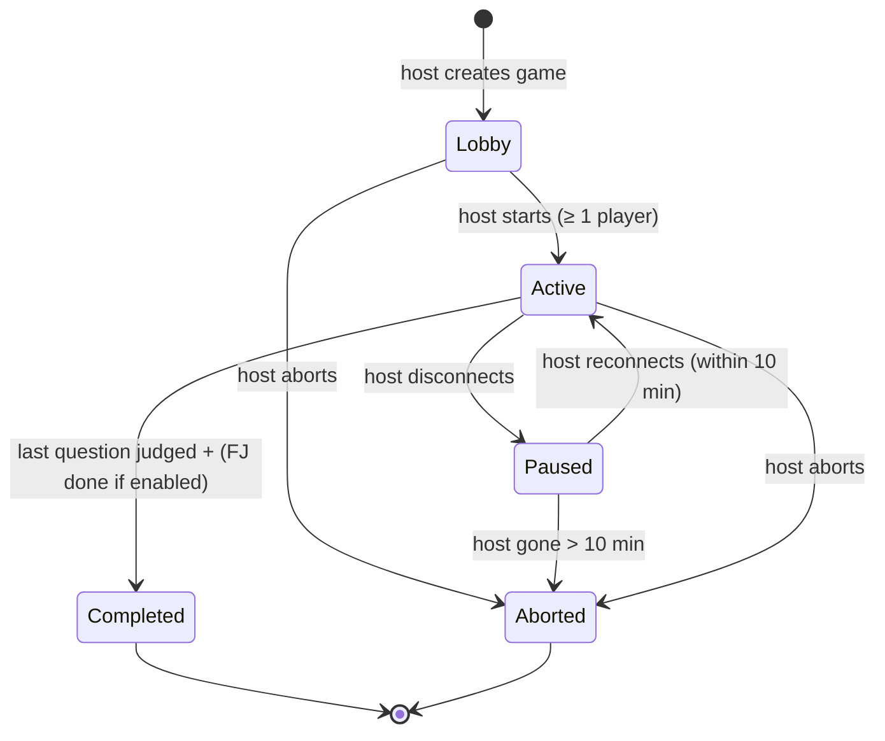
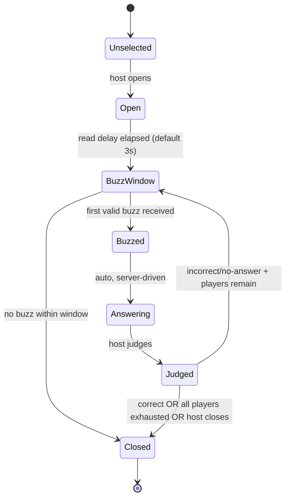
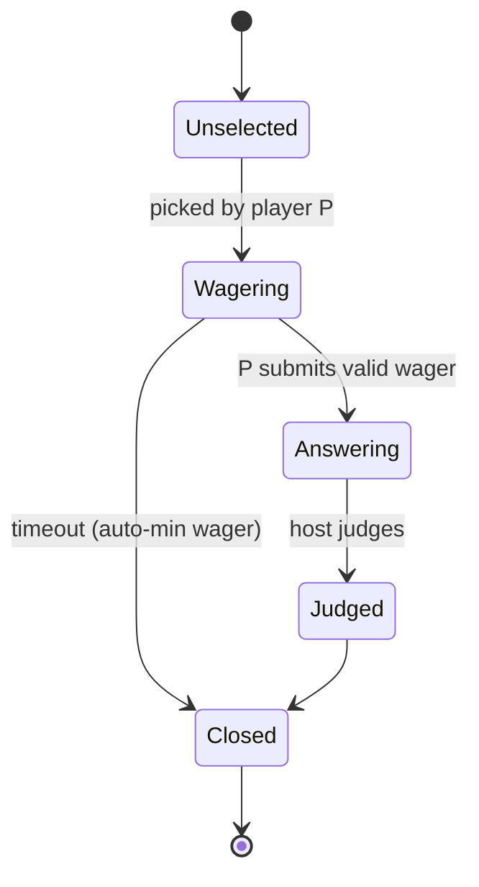
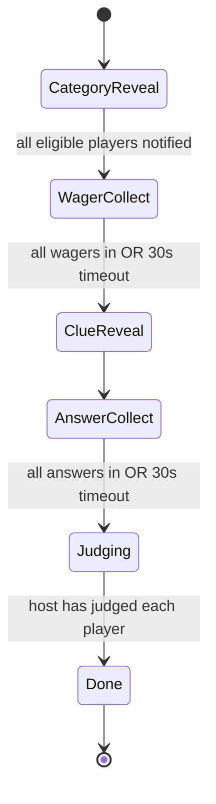
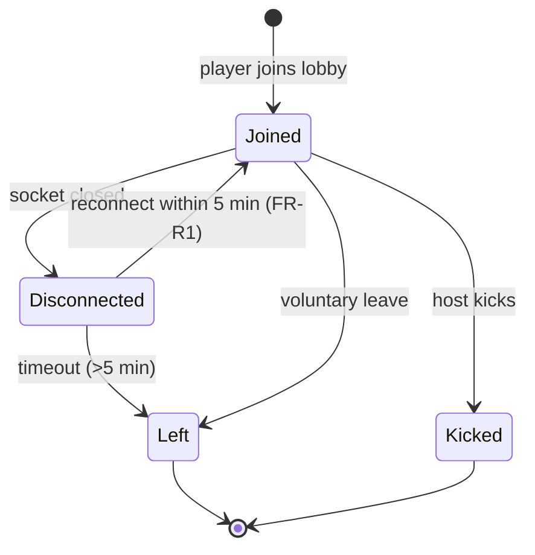
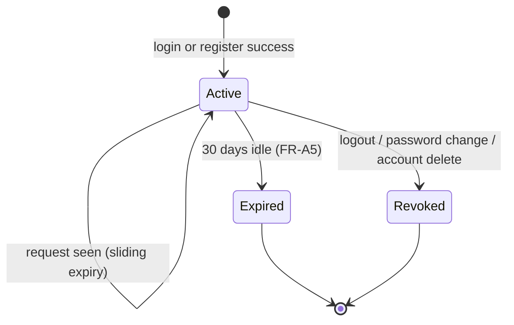
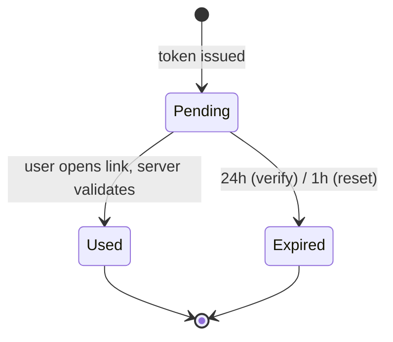
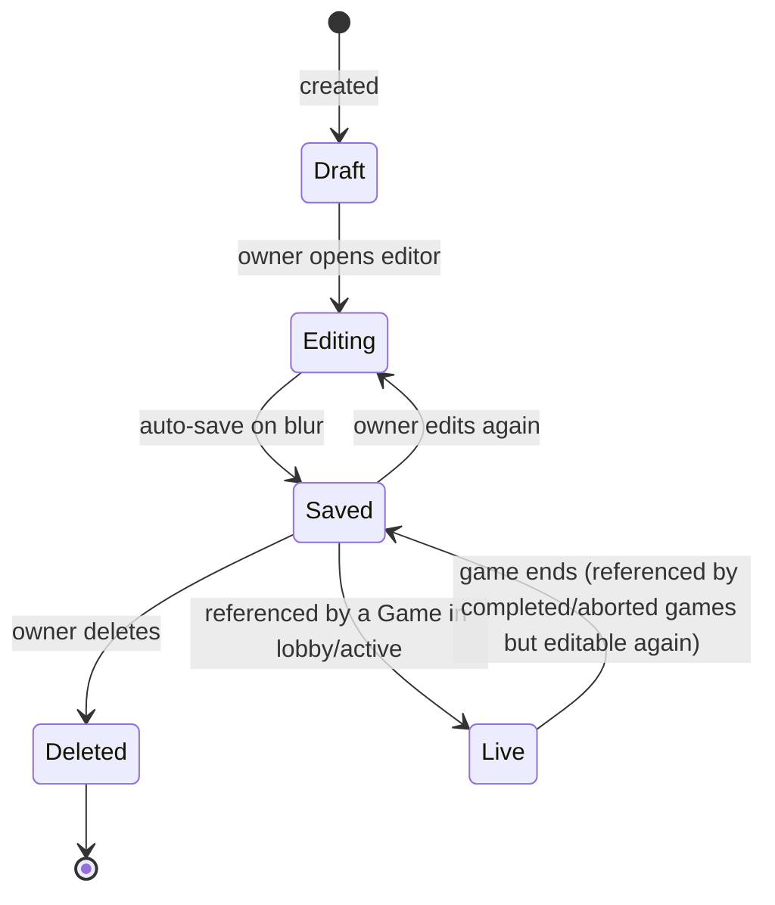

# State Machines

Authoritative state diagrams for stateful entities. The server owns
these state machines; clients render derived views.

## 1. Game lifecycle

Tracks `game.status`. One game per host at a time (FR-G6).

| State | Description | Realises |
| --- | --- | --- |
| `Lobby` | Players joining; not yet started. | FR-L1, FR-G1 |
| `Active` | Game in progress; per-question states (see §2) drive play. | FR-MG1+ |
| `Paused` | Host disconnected; no question state advances. | FR-R3 |
| `Completed` | All questions resolved; results visible. | FR-C1 |
| `Aborted` | Host abandoned or aborted; no results. | FR-G4, FR-R3 |

## 2. Per-question lifecycle (main round)

Tracks `game_question_state.state` for one selected question.

Notes:
- An "early buzz" (during `Open` before `BuzzWindow`) does not change
  state but locks the offending player out for 0.5 s (FR-MG3). It is
  recorded in `game_event`.
- `Answering` is short-lived; the host hears the verbal answer and
  judges within the answer window.

## 3. Daily Double (alternate question lifecycle)

When the picked question has `is_daily_double = true`, the lifecycle
diverges:

- Only player P can buzz/answer (FR-DD1).
- Wager bounds enforced server-side (FR-DD2).

## 4. Final Jeopardy lifecycle

Triggered after the main round completes if `options.final_enabled`.

Eligibility: players with `score > 0` (FR-FJ2). Ineligible players
remain spectating.

## 5. Player slot lifecycle

Tracks `game_player.status` for one player slot in one game.

Score is preserved across `Joined ↔ Disconnected`. A `Left` or
`Kicked` slot is not reusable in the same game.

## 6. Auth session lifecycle

Tracks `auth_session` rows.

## 7. Email verification token lifecycle

Tracks rows in `auth_verification` with `purpose = 'verify_email'`.
Same pattern applies to `'reset_password'` (1 h expiry, single use).

## 8. Quiz lifecycle (informational)

Quizzes do not have a status column; their lifecycle is implicit.

Editing while `Live` is allowed (FR-Q9): the live game holds a
snapshot.
