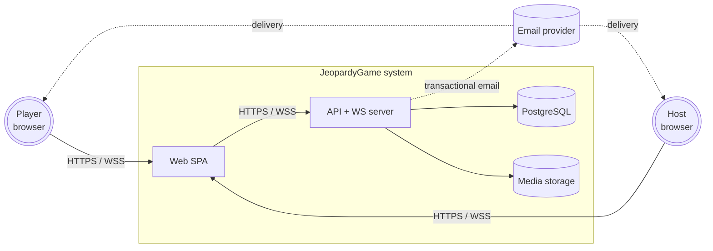
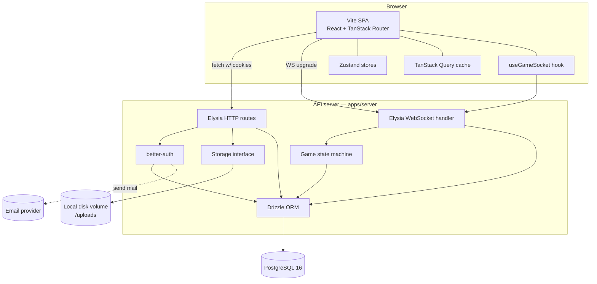
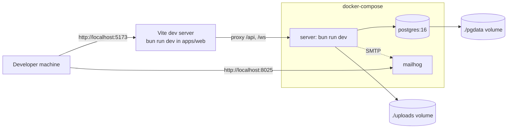
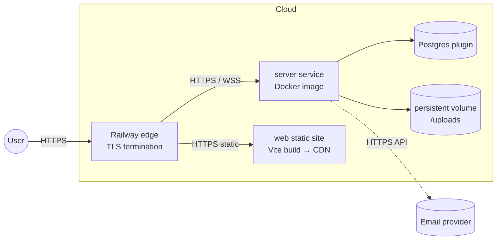
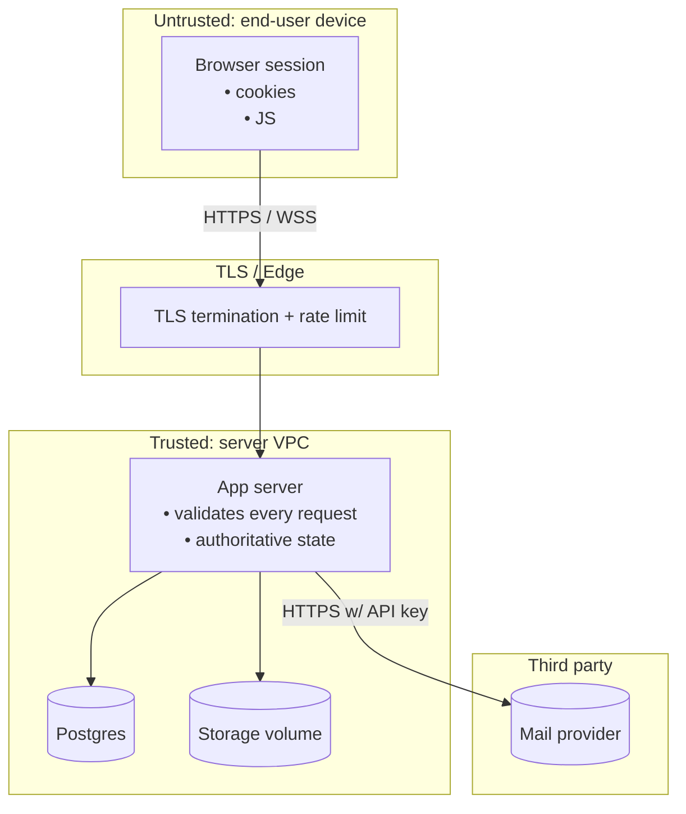
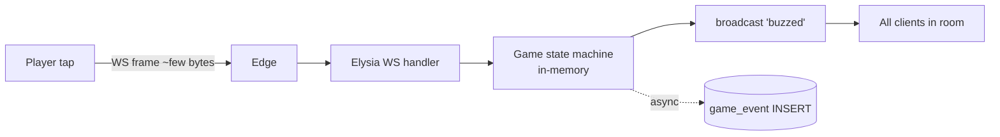

# System & Deployment Diagrams

System decomposition and deployment topology for JeopardyGame.

## 1. System context (C4 level 1)

External actors: browsers (any device, mobile-first per NFR-U1) and a
single transactional email provider (Resend or similar in production;
MailHog/console in dev).

## 2. Container view (C4 level 2)

### Component responsibilities

| Component | Responsibility |
| --- | --- |
| Vite SPA | Renders pages, runs the router, sends API + WS calls. No auth tokens in JS — auth via cookies. |
| Zustand stores | Live game state (board, scores, current question), pushed from WS. |
| TanStack Query cache | Server-state cache for HTTP endpoints (quizzes, profile, history). |
| `useGameSocket` | One per active game; manages WS connection, snapshot hydration, send actions. |
| Elysia HTTP | All REST endpoints; validates with `t` schemas; integrates with better-auth. |
| Elysia WS | Per-game rooms; multiplexes messages; enforces `state → allowed message` rules. |
| better-auth | Sign-up, sign-in, sessions, password hashing (Argon2id), email verification, password reset. |
| Game state machine | Authoritative transitions (`Lobby → Active → Completed/Aborted`) and per-question sub-states. |
| Storage | `put / get / delete` over an opaque key. Local-disk implementation in v1. |
| Drizzle ORM | Typed DB access. Migrations via `drizzle-kit`. |

## 3. Deployment — development (`docker-compose`)

- The Vite dev server runs **outside** docker-compose for faster HMR;
  the compose file owns Postgres + server + mail.
- Uploads persist in `./uploads`. Postgres data persists in `./pgdata`.
- MailHog catches outgoing email and exposes a UI at `:8025`.

## 4. Deployment — production (Railway)

- Web app is built once and served as static files (Railway's "static
  site" or behind a CDN). It calls the server at `api.<domain>`.
- Server is a single container; all WS connections terminate here. To
  scale beyond one instance, the WS room registry would need to move
  out of process (Redis pub/sub) — see Open Issues.
- Media volume is a Railway persistent volume; the same storage key
  scheme as dev applies. A future migration to S3/R2 swaps the
  Storage implementation only (FR-M3).

## 5. Trust boundaries

- **All client input crosses Untrusted → Trusted.** Validate with
  Elysia `t` schemas (NFR-S3); never trust client-supplied IDs without
  authorisation checks.
- Cookies are `HttpOnly`, `Secure`, `SameSite=Lax` (NFR-S2); JS in the
  browser cannot read them — only the browser includes them on
  same-site requests.
- Media file `Content-Type` from the client is **not** trusted; magic
  bytes are sniffed server-side (NFR-S6).
- Email provider API key lives only on the server; never shipped to
  the browser.

## 6. Data flow — buzz request (latency-critical)

- The state machine lives in process memory keyed by `roomCode`; the
  DB write is asynchronous and not on the hot path.
- Target: ≤ 150 ms p95 end-to-end (NFR-P1).
- Broadcast fan-out is direct (no pub/sub) for v1, limiting a single
  game to one server instance.

## 7. Failure modes & recovery

| Failure | User impact | Recovery |
| --- | --- | --- |
| WS dropped (client-side network) | Banner + auto-reconnect | Snapshot resync on connect (FR-R2). |
| Server restart | All in-flight games lose in-memory state | Recover from `game_event` on next connect (NFR-A3, best-effort). |
| Postgres unavailable | API 503; existing WS still live until next write | Retry with backoff; alert. |
| Storage volume full | Media uploads fail (413/507) | Operational alert; gameplay unaffected for non-media questions. |
| Mailer down | Verify / reset email queued | Retry by provider; user can request resend. |

## 8. Open infrastructure questions

- **OQ-INF-1** Single-instance assumption for v1 is acceptable while
  concurrent load is low. Beyond one instance: introduce Redis pub/sub
  for WS broadcast and migrate sticky-session WS routing.
- **OQ-INF-2** Decide CDN strategy for the SPA (Railway-default vs
  Cloudflare in front).
- **OQ-INF-3** Backup retention for Postgres beyond the default
  Railway plugin policy.
