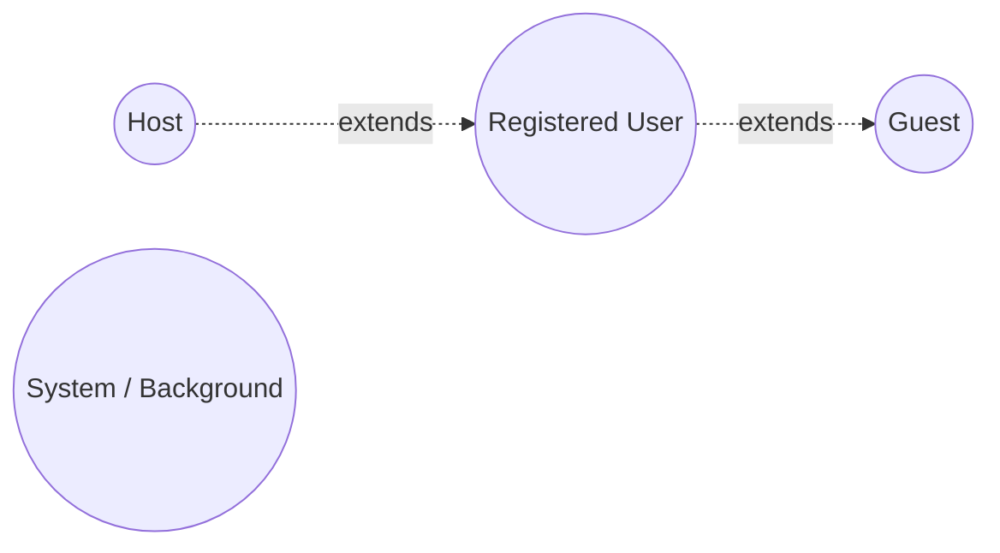

# Use Cases

References [`srs.md`](srs.md). Each use case lists the FR(s) it
realises.

## Actors

- **Guest** — unauthenticated browser visitor.
- **Registered User** — has an account; inherits Guest capabilities.
- **Host** — a Registered User currently running a game; inherits
  Registered User capabilities.
- **System** — automated / scheduled processes (email sender, expiry
  sweeper, timer enforcer).

## Use case diagram

```mermaid
flowchart TB
    subgraph Boundary [JeopardyGame]
        UC1((Register account))
        UC2((Verify email))
        UC3((Log in / log out))
        UC4((Reset password))
        UC5((Manage profile))
        UC6((Delete account))

        UC10((Create quiz))
        UC11((Edit quiz))
        UC12((Delete quiz))
        UC13((List own quizzes))
        UC14((Share quiz by link))
        UC15((Upload media))

        UC20((Start game from quiz))
        UC21((Manage lobby))
        UC22((Run question))
        UC23((Judge answer))
        UC24((Run Daily Double))
        UC25((Run Final Jeopardy))
        UC26((End / abort game))

        UC30((Join game by code))
        UC31((Buzz in))
        UC32((Submit Final Jeopardy wager and answer))
        UC33((View final scoreboard))
        UC34((Reconnect to game))

        UC40((Send verification email))
        UC41((Send reset email))
        UC42((Expire stale sessions / games))
        UC43((Garbage-collect orphan media))
    end

    Guest --> UC1
    Guest --> UC3
    Guest --> UC30
    Guest --> UC31
    Guest --> UC32
    Guest --> UC33
    Guest --> UC34

    User --> UC2
    User --> UC4
    User --> UC5
    User --> UC6
    User --> UC10
    User --> UC11
    User --> UC12
    User --> UC13
    User --> UC14
    User --> UC15
    User --> UC20

    Host --> UC21
    Host --> UC22
    Host --> UC23
    Host --> UC24
    Host --> UC25
    Host --> UC26

    System --> UC40
    System --> UC41
    System --> UC42
    System --> UC43
```

## Use case descriptions

The level of detail below targets the gameplay-critical flows. Simpler
CRUD use cases (UC10–UC13, UC5, UC12) follow standard form and do not
need full templates.

---

### UC1 — Register account
- **Actor**: Guest
- **Realises**: FR-A1, FR-A4, NFR-S5
- **Precondition**: User does not have an account with the given email.
- **Main flow**:
  1. Guest submits email, password, display name.
  2. System validates inputs (email format, password strength, name
     length).
  3. System creates user record, hashes password (Argon2id).
  4. System enqueues a verification email (UC40).
  5. System creates a session and returns the user to the homepage,
     logged in but **unverified**.
- **Alternate flows**:
  - 2a. Validation fails → return error, no account created.
  - 2b. Email already in use → return generic error (no enumeration).
  - 5a. Rate limit exceeded → 429.
- **Postcondition**: User exists, session active, verification pending.

---

### UC2 — Verify email
- **Actor**: Registered User
- **Realises**: FR-A2
- **Precondition**: User received a verification email containing a
  signed token URL.
- **Main flow**:
  1. User clicks the verification link.
  2. System validates the token (signature + expiry).
  3. System marks the user `email_verified`.
  4. System redirects user to their profile.
- **Alternate flows**:
  - 2a. Token invalid or expired → show error with "resend" option.

---

### UC3 — Log in / log out
- **Actor**: Guest (login) / Registered User (logout)
- **Realises**: FR-A3, FR-A5, FR-A6, NFR-S2, NFR-S5
- **Login main flow**:
  1. Guest submits email + password.
  2. System verifies credentials, creates session, sets cookie.
  3. Redirect to the page the user was attempting (or homepage).
- **Logout main flow**:
  1. User clicks Log out.
  2. System invalidates the session record and clears the cookie.

---

### UC4 — Reset password
- **Actor**: Guest
- **Realises**: FR-A7, NFR-S5
- **Main flow**:
  1. User enters email on the reset form.
  2. System (regardless of whether the email exists) responds 200 to
     prevent enumeration; if the email exists, enqueues a reset email
     (UC41) with a one-time token (1h expiry).
  3. User clicks the link, sets a new password.
  4. System updates the password hash, invalidates all existing
     sessions for that user, redirects to login.

---

### UC5 — Manage profile
- **Actor**: Registered User (owner)
- **Realises**: FR-P1, FR-P2
- Users update display name and avatar. Updates are visible to other
  users on subsequent profile views; in-flight games keep the
  per-game display name unchanged.

---

### UC6 — Delete account
- **Actor**: Registered User
- **Realises**: FR-A9, NFR-L2
- **Main flow**:
  1. User confirms with current password.
  2. System: deletes owned quizzes (cascades to questions and
     orphans media → UC43); anonymises participation in completed
     games; aborts any active game owned by the user; invalidates
     all sessions; deletes the user record (or marks `deleted_at`
     for the 30-day grace window per NFR-L2).

---

### UC10 — Create quiz
- **Actor**: Registered User
- **Realises**: FR-Q1–FR-Q5
- **Main flow**:
  1. User clicks "New quiz" on My Quizzes.
  2. System creates a draft quiz (empty board) and opens the editor.
  3. User fills categories, questions, point values, marks Daily
     Doubles, optionally adds Final Jeopardy.
  4. User uploads media as needed (UC15).
  5. Drafts auto-save on field blur.

---

### UC11 — Edit quiz
- **Actor**: Registered User (owner)
- **Realises**: FR-Q6, FR-Q9
- Editing a quiz that has historic completed games is permitted; the
  completed games retain their snapshot (FR-G2).

---

### UC14 — Share quiz by link
- **Actor**: Registered User (owner)
- **Realises**: FR-Q8
- **Main flow**:
  1. Owner clicks "Share" → system generates an unguessable token URL
     (e.g. `/quiz/share/{token}`).
  2. Recipient opens the URL, sees only the title (and optionally
     metadata per OQ-4) plus a "Wait for the host to start a game"
     prompt or a join field.

---

### UC15 — Upload media
- **Actor**: Registered User
- **Realises**: FR-M1–FR-M3, FR-M6
- **Main flow**:
  1. User drops or selects a file in the question editor.
  2. Client uploads to `POST /media`.
  3. Server validates type, size, duration; stores via `Storage`;
     returns media ID + URL.
  4. Editor associates media ID with the question.

---

### UC20 — Start game from quiz
- **Actor**: Registered User (must be email-verified per FR-A2)
- **Realises**: FR-G1, FR-G2, FR-G3, FR-G6
- **Main flow**:
  1. User opens a quiz in My Quizzes, clicks "Host game".
  2. System checks the user has no other active/lobby game (FR-G6).
  3. System snapshots the quiz, allocates a room code, creates game
     in `LOBBY` state.
  4. User is redirected to the host lobby view, becoming the **Host**.

---

### UC21 — Manage lobby
- **Actor**: Host
- **Realises**: FR-L1–FR-L4
- Host watches players join, may kick a player, and starts the game
  when ready (≥ 1 player).

---

### UC22 — Run question
- **Actor**: Host
- **Realises**: FR-MG1–FR-MG9
- See [`sequence-diagrams.md`](sequence-diagrams.md) for the full
  buzz cycle.

---

### UC23 — Judge answer
- **Actor**: Host
- **Realises**: FR-MG4, FR-MG5
- Host marks the buzzed-in player's verbal answer as correct,
  incorrect, or no-answer; system updates score and state machine.

---

### UC24 — Run Daily Double
- **Actor**: Host (with picking Player as collaborator)
- **Realises**: FR-DD1–FR-DD3
- Picking player wagers within bounds; only that player can answer.

---

### UC25 — Run Final Jeopardy
- **Actor**: Host
- **Realises**: FR-FJ1–FR-FJ4

---

### UC26 — End / abort game
- **Actor**: Host
- **Realises**: FR-G4, FR-C1, FR-C2

---

### UC30 — Join game by code
- **Actor**: Guest or Registered User
- **Realises**: FR-J1–FR-J4
- **Main flow**:
  1. User opens "Join" page, enters code and display name.
  2. System validates code, capacity, game state.
  3. User joins as Player; lobby updates for everyone.
- **Alternate**:
  - 2a. Game full / aborted / completed → reject with reason.
  - 2b. Same browser session previously joined → reconnect (UC34).

---

### UC31 — Buzz in
- **Actor**: Player
- **Realises**: FR-MG2, FR-MG3
- **Main flow**:
  1. Question opens, buzz window opens after the read delay.
  2. Player taps the buzz button.
  3. Server stamps timestamp, evaluates "first valid buzz".
  4. If first: player goes into `ANSWERING`. Otherwise: ignored.

---

### UC32 — Submit Final Jeopardy wager and answer
- **Actor**: Player
- **Realises**: FR-FJ2, FR-FJ3

---

### UC33 — View final scoreboard
- **Actor**: All participants
- **Realises**: FR-C1, FR-C2

---

### UC34 — Reconnect to game
- **Actor**: Player or Host
- **Realises**: FR-J4, FR-R1–FR-R3
- See sequence diagrams for the snapshot-on-connect flow.

---

### UC40 / UC41 — System: send email
- **Actor**: System
- **Realises**: FR-E1, FR-E2

### UC42 — System: expire stale sessions / games
- **Actor**: System
- **Realises**: FR-A5, FR-R1, FR-R3

### UC43 — System: garbage-collect orphan media
- **Actor**: System
- **Realises**: FR-M5

## Cross-cutting non-functional concerns

Every interactive use case is subject to:
- **NFR-S3** server-side authorization,
- **NFR-S4** XSS sanitisation of any rendered user content,
- **NFR-S5** rate limiting where applicable,
- **NFR-U1** mobile-first usability.
